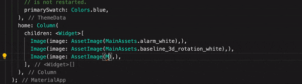

# Assets Scanner
As you know, you need to use the image path to [load image](https://flutter.dev/docs/development/ui/assets-and-images#loading-images-1) in Flutter
, e.g., `AssetImage('graphics/background.png')`. However, this approach is prone to errors, such as the spelling of the path, you can only find this error after the program runs, and you may not be able to intuitively know which picture this is through the path. Assets Scanner helps you generate constants for assets, reducing the probability of misspellings. At the same time, you can hover over the constants to preview the images more intuitively.

## Usage
### Create a file with a `.assets.dart` suffix
Create a file with a `.assets.dart` suffix, and add the `part` to allow Assets Scanner generate the `.assets.g.dart` file, e.g.,
```dart
// myasset.assets.dart

part 'myasset.assets.g.dart';
```

Then run `flutter packages pub run build_runner build`, Assets Scanner will generates constants for all files under `assets` folder by default.

### Custom `assetPathPattern`
Assets Scanner will generates constants for all files under `assets` folder by default, but you can customize the asset path. You can add the `assetPathPattern` constant to the `.assets.dart` file, for example, change the `assetPathPattern ` to `another/assets/**`:
```dart
// myasset.assets.dart

part 'myasset.assets.g.dart';

const String assetPathPattern = "another/assets/**";
```

### Preview images
Now, you can preview images by hovering to the constants:



## License
    Copyright (C) 2020 littlegnal

    Licensed under the Apache License, Version 2.0 (the "License");
    you may not use this file except in compliance with the License.
    You may obtain a copy of the License at

        http://www.apache.org/licenses/LICENSE-2.0

    Unless required by applicable law or agreed to in writing, software
    distributed under the License is distributed on an "AS IS" BASIS,
    WITHOUT WARRANTIES OR CONDITIONS OF ANY KIND, either express or implied.
    See the License for the specific language governing permissions and
    limitations under the License.